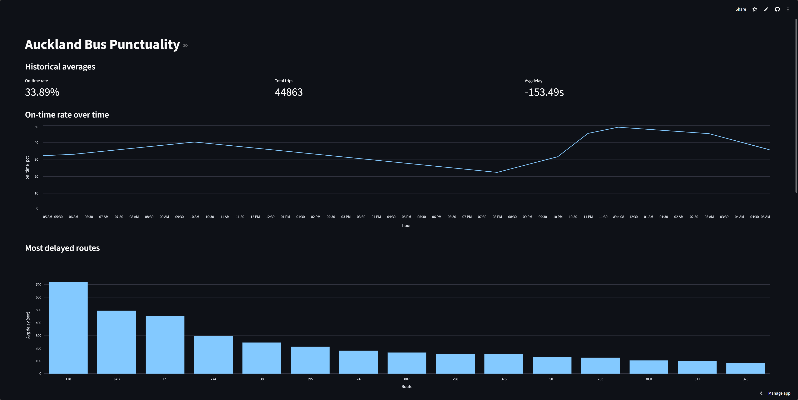

# Bus Checker
A data pipeline that tracks Auckland bus punctuality in real time, from api call to an interactive meaningful dashboard.

Live dashboard: https://bus-checker-6tnym6fnxec5a25rbwoz8d.streamlit.app/



## What it does
Collects real-time bus data from Auckland Transport via Airflow/Github Actions, stores it in a cloud database, transforms it with dbt, and visualises data by graph/chart via Streamlit.

**Scope:** **Auckland buses only (GTFS route_type = 3),** trains and ferries are excluded. (as they are less meaningful to track)

## Architecture
AT Realtime API ──> Python ingestion (Airflow for local/Github Actions for cloud) ──> Supabase (Postgres) ──> dbt(SQL) ──> Streamlit dashboard

## Features
- Network summary — overall on-time rate, total trips, average delay
- On-time rate over time — hourly punctuality trend (NZ timezone)
- Most delayed routes — ranked by average delay, with readable route names
- Stop-level delay — which stops give more deley on a particular route
- Direction comparison — inbound vs outbound punctuality per route
- **Ongoing..**

## How to use it
You can just check live dashboard: https://bus-checker-6tnym6fnxec5a25rbwoz8d.streamlit.app/

If you want to play it locally:

This means running the whole pipeline yourself — collecting data with your own credentials, storing it in your own Supabase, and viewing the dashboard on your machine. You'll need your own SUPABASE_DB_URL and AT_SUB_KEY (see Notes below).

Download zip, use VSCode to open the folder, you also need Docker installed and opened if you wish to use Airflow locally.
```
pip install -r requirements.txt
# set SUPABASE_DB_URL and AT_SUB_KEY in .env

make collect       # single collection without airflow, Docker free
make load-gtfs     # load static GTFS data
make airflow-up    # scheduled and repeat collections, Airflow, Docker required
make airflow-down  # turn off Airflow
make dbt-run       # build dbt models
make dashboard     # launch dashboard
```
### Notes:

- **SUPABASE_DB_URL** is required, it is an online storage URL, Supabase is free, get account for yourself, so data will go to your cloud storage. Link: https://supabase.com/

- **AT_SUB_KEY** is required but free to register, link: https://dev-portal.at.govt.nz/

- Airflow is for local run, it collect and pump the data to cloud. `http://localhost:8080/` is the portal. Live dashboard rely on Github Actions, due to it's on free tier, so collection is less frequent.

- Streamlit（dashboard）has free resource for you to play. Link: https://streamlit.io/

**Bus data © Auckland Transport, licensed under CC BY 4.0.**